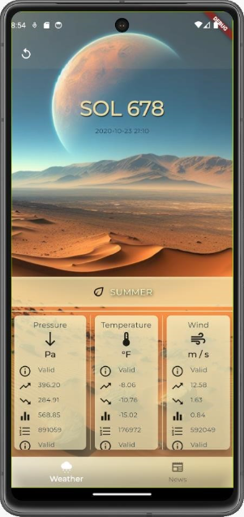

# Stellaris app

## Table of Contents

1. [Introduction](#introduction)
2. [Technology Stack](#technology-stack)
   - [Mobile Application](#mobile-application)
   - [Environments](#environments)
   - [Backend](#backend)
   - [Database](#database)
   - [Infrastructure](#infrastructure)
3. [Application Presentation](#application-presentation)

## Introduction

The purpose of this project was to create a mobile application using the Flutter framework and a backend API using ASP .NET Core 8. The cloud infrastructure was built using Azure and Terraform. Weather data is obtained by integrating the application with the NASA API: [InSight: Mars Weather Service API](https://api.nasa.gov/assets/insight/InSight%20Weather%20API%20Documentation.pdf).

## Technology Stack

### Mobile Application

The mobile application interface was developed using the Flutter framework, ensuring a responsive and multi-platform user interface.

### Used environments

- **Mobile Emulator:** Android Studio
- **Backend Development:** Visual Studio
- **Flutter Development:** Visual Studio Code

### Backend

Rest API; ASP .NET Core 8 framework.

### Database

PostgreSQL with Npgsql provider. ORM: EF Core.

### Infrastructure

Terraform was used for infrastructure management as code. The application was prepared for deployment in Azure.

## Application Presentation

The application enables users to fetch weather data for Mars using the NASA API: InSight: Mars Weather Service API. Users can check metrics for a given Martian day (SOL) such as pressure, temperature, and wind speed. Additionally, the application provides news related to space exploration, Mars, etc. Users can also create their own posts for specific categories. The application features a global theme that changes depending on the season.

**Main Screen:**\

**Available Themes:**\

Navigating to a widget displaying metrics such as pressure and temperature leads to a detailed view:

The metrics view allows users to select a specific Martian day (top right corner). The application's state is updated between widgets, so returning to the main screen will display data for the selected day.

**News Tab and Adding a New Post (plus sign):**\

